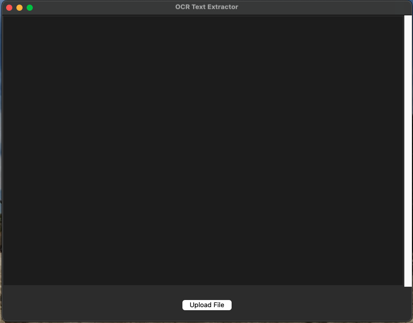

# Arabic OCR Text Extractor

This project is a simple OCR (Optical Character Recognition) text extractor for Arabic language, which supports both PDF and image files. It uses Tkinter for the GUI, pdf2image for converting PDF pages to images, pytesseract for extracting text from images, and PIL for image processing.

## Features

- Extract text from PDF files and image files.
- Drag and drop files directly into the application.
- Supports right-to-left text display.

## Installation

1. Clone the repository:
   ```sh
   git clone https://github.com/bilalkamal/Arabic_OCR.git
   cd Arabic_OCR
   ```

2. Create and activate a virtual environment:
   ```sh
   python -m venv myenv
   source myenv/bin/activate  # On Windows use `myenv\Scripts\activate`
   ```

3. Install the required Python packages:
   ```sh
   pip install -r requirements.txt
   ```

4. Install Tesseract OCR on your machine. Follow the instructions in the [Tesseract documentation](https://github.com/tesseract-ocr/tesseract).

## Requirements
```sh
pip install -r requirements.txt
```

## Usage

Run the application:
```sh
python Arabic_OCR.py
```

### GUI Instructions

- **Upload File**: Click the "Upload File" button to select a PDF or image file using a file dialog.
- **Drag and Drop**: Drag and drop a PDF or image file directly into the application window.

The extracted text will be displayed in the text area.

## Screenshots
